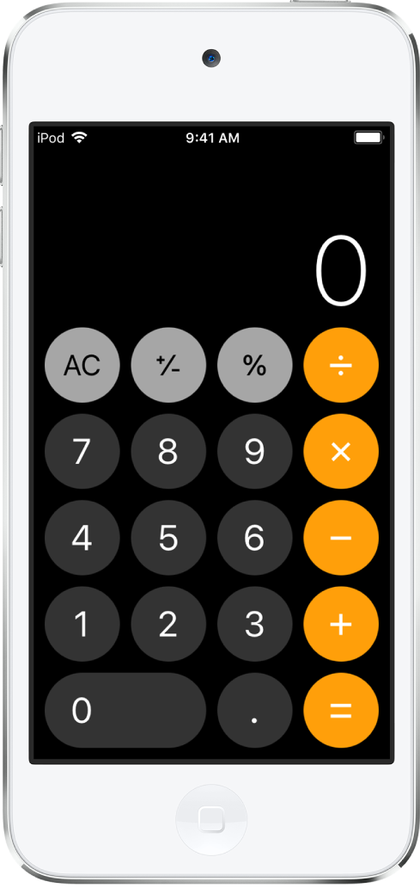

# Sujet : Calculatrice Appleton

## I. Introduction

HTML, CSS et JavaScript sont les trois technologies qui composent la majorité des sites web. Aujourd'hui, votre mission est de recréer la célèbre calculatrice de l'iPhone. L'objectif n'est pas de tout réussir, mais de comprendre comment construire une petite application interactive.



## II. La Calculatrice

Votre téléphone refuse soudainement de faire le moindre calcul... Heureusement, vous connaissez un peu le développement web ! Vous allez donc créer votre propre calculatrice, étape par étape.

<!-- Commencez par créer trois fichiers dans un même dossier : `index.html`, `style.css` et `script.js`.

Pour que votre page fonctionne, ces trois fichiers doivent être **reliés entre eux** : le fichier HTML doit « charger » la feuille de style CSS et le fichier JavaScript. Ces liens se placent dans le HTML.

> **Posez-vous les questions :** « comment lier un fichier CSS à une page HTML », « comment ajouter un fichier JavaScript à une page HTML ». Vous découvrirez les balises qui servent à relier une feuille de style et un script à une page web, et où les placer dans le document. -->

### Étape 1 : Construire l'interface (HTML)

Objectif : créer la structure de la calculatrice, c'est-à-dire un écran d'affichage et une grille de boutons (chiffres, opérateurs, AC et =).

Pour cela, vous aurez besoin de trois notions de base :

- **Les conteneurs** : une « boîte » qui regroupe plusieurs éléments (par exemple l'écran, ou l'ensemble des boutons). C'est le rôle de la balise « division ».
- **Les boutons** : chaque chiffre et chaque opérateur est un élément cliquable.
- **Le texte** : afficher une valeur (un chiffre, le résultat) à l'intérieur d'un élément.

Réfléchissez à l'organisation : un conteneur principal, à l'intérieur un écran, puis un conteneur pour tous les boutons. Pensez aussi à donner un **nom** (une classe) à vos éléments : cela vous servira ensuite pour les styliser en CSS et les retrouver en JavaScript.

> **Posez-vous les questions :** « à quoi sert la balise div en HTML », « créer un bouton en HTML », « balise span HTML », et « attribut class HTML c'est quoi ». Le but ici n'est **pas** encore de faire fonctionner les boutons, mais d'avoir une page qui **ressemble** à une calculatrice.

### Étape 2 : Styliser la calculatrice (CSS)

Objectif : reproduire le style de la calculatrice Apple grâce au CSS : fond sombre, boutons ronds, chiffres en gris foncé et opérateurs en orange.

Le principe du CSS est simple : vous **sélectionnez** un élément (par son nom de classe) puis vous lui appliquez des **propriétés** (couleur, taille, forme...).

> **Posez-vous les questions :** « sélectionner une classe en CSS », « changer la couleur de fond en CSS », « changer la couleur du texte en CSS », « arrondir les coins d'un élément en CSS » (pour les boutons ronds) et « changer la taille du texte en CSS ».

Pour aligner tous les boutons proprement, une **grille CSS** est idéale. Elle permet de ranger des éléments en lignes et colonnes automatiquement. Voici un exemple de son fonctionnement :

```css
.buttons {
  display: grid;
  grid-template-columns: repeat(4, 1fr);
  gap: 12px;
}
```

Ici, on demande 4 colonnes de largeur égale, avec un espace entre chaque case. À vous d'adapter ce principe à votre calculatrice.

> **Posez-vous les questions :** « comment faire une grille en CSS » et « CSS flexbox débutant » pour comprendre comment positionner les éléments les uns par rapport aux autres.

### Étape 3 : Afficher les chiffres au clic (JavaScript)

Objectif : quand on clique sur un chiffre, il doit s'ajouter à l'écran.

La logique se décompose en trois idées :

1. **Retrouver un élément** de la page depuis le JavaScript (l'écran, un bouton...).
2. **Détecter un clic** sur un bouton : on « écoute » l'évènement de clic.
3. **Modifier le texte** affiché à l'écran pour y ajouter le chiffre cliqué.

Astuce : plutôt que d'écrire le code pour chaque bouton un par un, cherchez comment récupérer **tous** les boutons d'un coup et leur appliquer le même comportement en une seule fois.

> **Posez-vous les questions :** « sélectionner un élément HTML en JavaScript » (retrouver un élément), « sélectionner plusieurs éléments en JavaScript » (récupérer tous les boutons), « détecter un clic sur un bouton en JavaScript » (réagir au clic) et « modifier le texte d'un élément en JavaScript » (afficher un chiffre à l'écran).

Attention à un détail : pensez à ne pas garder le `0` affiché par défaut lorsque l'utilisateur tape son premier chiffre !

### Étape 4 : Faire fonctionner les opérations

Objectif : lorsqu'on clique sur un opérateur (+, -, ×, ÷), il faut **mémoriser** le premier nombre et l'opération choisie. Puis, au clic sur `=`, effectuer le calcul et afficher le résultat.

Pour cela, vous aurez besoin de **variables** qui « retiennent » des informations entre deux clics : le premier nombre saisi et l'opérateur choisi.

Réfléchissez à l'enchaînement :

- Au clic sur un opérateur → je retiens le nombre déjà à l'écran et l'opération, puis je vide l'écran pour saisir le second nombre.
- Au clic sur `=` → je récupère le second nombre, je fais le calcul avec le premier, et j'affiche le résultat.

Un dernier point : le texte de l'écran est une chaîne de caractères, pas un nombre. Il faudra donc le **convertir** avant de calculer.

> **Posez-vous les questions :** « créer une variable en JavaScript », « les opérateurs de calcul en JavaScript », « utiliser un switch en JavaScript » (pratique pour choisir l'opération à faire) et « transformer un texte en nombre en JavaScript » (pour pouvoir calculer avec ce qui est écrit à l'écran).

### Étape 5 : Ajouter le bouton AC

Objectif : le bouton `AC` (All Clear) doit tout réinitialiser : l'écran ainsi que les variables qui retiennent le premier nombre et l'opérateur.

C'est le même principe qu'à l'étape 3 (détecter un clic), mais cette fois l'action consiste à remettre l'écran à `0` et à « oublier » ce qui avait été mémorisé.

## III. Le bout du tunnel

Félicitations, vous avez une calculatrice fonctionnelle ! Si vous avez terminé :

- Ajouter le bouton +/-.
- Ajouter le bouton %.
- Gérer les nombres décimaux.
- Empêcher la division par zéro.
- Autoriser les calculs en chaîne.
- Contrôler la calculatrice avec le clavier.
- Reproduire le design de la calculatrice Apple le plus fidèlement possible.

> Si vous êtes curieux, pensez à poser vos questions aux Cobras. Ils seront ravis de partager leurs connaissances avec vous.
